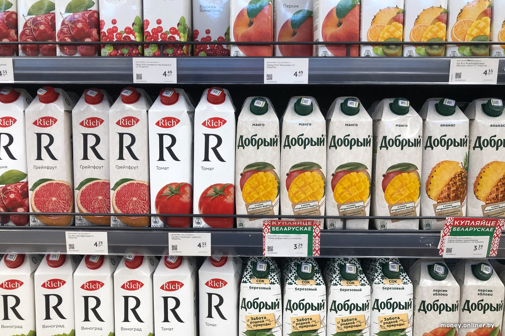

# Search by pattern
В проекте реализована задача поиска по шаблону. Давался шаблон в виде товара с полок магазинов и было необходимо найти эти товары. Для работы был использован OpenCV.

## Пример шаблона и полок с товарами
Для работы были выбраны несколько товаров с разных полок для поиска.

<b>Шаблон продукта</b><br>
[](template/template_6.jpg)

<b>Шаблон полки с товарами</b><br>
[](train/train_6.jpg)

## Пример поискового запроса
[](results/tomato_juice.jpg)

## Принцип работы
1. Выравнивание изображений - добавление черных полос для единообразного отображения
2. Поиск особенностей - детекция ключевых точек с помощью SIFT
3. Сопоставление дескрипторов- Brute-Force матчинг с фильтрацией по Лоу (Lowe's ratio test)
4. Нахождение преобразования- вычисление гомографии через RANSAC для точного позиционирования
5. Визуализация - выделение найденных объектов bounding box
6. Итеративный поиск - многократное обнаружение с исключением найденных областей

## Настройки точности
Для тонкой настройки можно изменять параметр `ratio` в фильтре Лоу:
- **Высокий ratio** → больше совпадений (выше чувствительность)
- **Низкий ratio** → жестче фильтрация (выше точность)

## Запуск программы

1. Клонируйте репозиторий:
```bash
git clone https://github.com/KarinaCreate/Search-by-pattern
cd Search-by-pattern
```

Установите зависимости:
```bash
pip install -r requirements.txt
```

Запустите основной скрипт:
```bash
python Search_by_pattern.py
```
